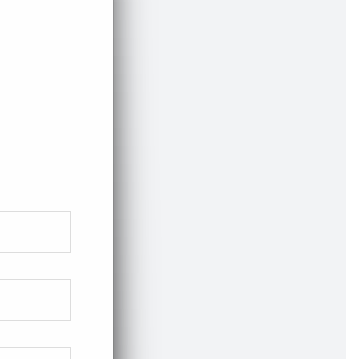

## 安装Cloudflared

可到官网下载相对应的版本
[地址](https://github.com/cloudflare/cloudflared)



## 登陆Cloudflared

```bash
chmod +x cloudflared-linux-amd64
```

```bash
mv cloudflared-linux-amd64 cloudflared
```

```
./cloudflared login
```

输入命令后，终端会给出一个登陆地址，我们拷贝到浏览器里面打开，选择需要授权的网站。

## 创建隧道

```bash
./cloudflared tunnel create <隧道名字>
# 比如
./cloudflared tunnel create webserver-1
```

创建完以后，会输出隧道的一个UUID，记录下来(建议直接将输出的复制下来)

#### **需要记住的下面会用到**

 <u>/root/.cloudflared/12345-123-123-123-12345.json.</u> 

<u>12345-123-123-123-12345</u>（这一段便是隧道UUID）

```bash
[root@Web-Server-1]# cloudflared tunnel create webserver-1
Tunnel credentials written to /root/.cloudflared/12345-123-123-123-12345.json. cloudflared chose this file based on where your origin certificate was found. Keep this file secret. To revoke these credentials, delete the tunnel.

Created tunnel webserver-1 with id 12345-123-123-123-12345
```

## 域名指向

接着，我们需要把域名指向到对应的隧道

注意：下面的命令只会对第一个授权的顶级域名生效，比如abc.com和*.abc.com。如果有多个域名，比如123.com、456.com，需要手工添加CNAME记录。

```bash
./cloudflared tunnel route dns <隧道名字> <域名>
# 比如一级域名（和Web界面不一样，不需要输入@）
./cloudflared tunnel route dns webserver-1 abc.com
# 又比如二级域名
./cloudflared tunnel route dns webserver-1 www.abc.com
```

这时候，Cloudflare会自动添加一条CNAME记录到对应的域名。

对于多个其他域名，我们需要登录Cloudflare的Web控制台，对应添加CNAME记录，记录值是

```bash
<隧道UUID>.cfargotunnel.com

比如

12345-123-123-123-12345.cfargotunnel.com（记录的UID）
```


## 配置Cloudflared

接着，我们开始配置Cloudflared，先编辑一个配置文件

```bash
nano ~/.cloudflared/config.yml
```

输入下面的内容（根据自己要求编辑）

[TOC]

```yaml
tunnel: <隧道UUID>
credentials-file: /root/.cloudflared/<隧道UUID>.json
protocol: h2mux
ingress:
  # 第一个网站，连接到本地的80端口
  - hostname: <域名1.com>
    service: http://localhost:80
  # 第二个网站，https协议，连接到本地的443端口，禁用证书校验（用于自签名SSL证书）
  - hostname: <域名2.com>
    service: https://127.0.0.1:443
    originRequest:
      noTLSVerify: true
      originServerName: <域名2.com>
  # 第三个网站，8012端口，泛域名
  - hostname: <*.域名3.com>
    service: http://localhost:8012
  # 第四个，反代MySQL sock服务
  - hostname: <mysql.域名4.com>
    service: unix:/tmp/mysql.sock
  # 第五个，反代SSH服务
  - hostname: <ssh.域名5.com>
    service: ssh://localhost:22
  - service: http_status:404
```

注意：配置文件必须以  - service: http_status:404 结尾

编辑完之后

`ctrl+O`保存文件再`ctrl+X`退出文件

配置完以后，我们测试下配置文件有没有问题（返回OK就是没问题）

```bash
./cloudflared tunnel ingress validate
```


## 测试运行

如果没问题，OK，一切妥当，我们开始测试

```bash
./cloudflared --loglevel debug --transport-loglevel warn --config ~/.cloudflared/config.yml tunnel run <隧道UUID>
#如
./cloudflared --loglevel debug --transport-loglevel warn --config ~/.cloudflared/config.yml tunnel run 12345-123-123-123-12345
```

## 创建系统服务

按下Ctrl+z，先停掉刚才启动的服务。为了让服务能每次系统启动的时候都跟着启动，我们需要把Cloudflared注册成系统服务。不然系统一重启，就歇菜了。

```bash
./cloudflared service install
systemctl start cloudflared
systemctl status cloudflared
```

跑完这三条命令，应该就可以看到服务有正常输出，并且Web控制台也可以看到状态是Active。

```
● cloudflared.service - cloudflared
     Loaded: loaded (/etc/systemd/system/cloudflared.service; enabled; vendor preset: disabled)
     Active: active (running) since Fri 2022-12-09 17:22:43 CST; 9s ago
   Main PID: 37812 (cloudflared)
      Tasks: 18 (limit: 407348)
     Memory: 23.5M
        CPU: 71ms
     CGroup: /system.slice/cloudflared.service
             └─37812 /usr/local/bin/cloudflared --no-autoupdate --config /etc/cloudflared/config.yml tunnel run

Dec 09 17:22:42 Web-Server-1 cloudflared[37812]: 2022-12-09T09:22:42Z INF Generated Connector ID: 12345-123-123-123-12345
Dec 09 17:22:42 Web-Server-1 cloudflared[37812]: 2022-12-09T09:22:42Z INF Initial protocol h2mux
Dec 09 17:22:42 Web-Server-1 cloudflared[37812]: 2022-12-09T09:22:42Z INF ICMP proxy will use 127.0.0.1 as source for IPv4
Dec 09 17:22:42 Web-Server-1 cloudflared[37812]: 2022-12-09T09:22:42Z INF ICMP proxy will use ::: in zone eno1 as source for IPv6
Dec 09 17:22:42 Web-Server-1 cloudflared[37812]: 2022-12-09T09:22:42Z INF Starting metrics server on 127.0.0.1:12345/metrics
Dec 09 17:22:43 Web-Server-1 cloudflared[37812]: 2022-12-09T09:22:43Z INF Connection 12345-123-123-123-12345 registered connIndex=0 ip=<nil> location=SJC
Dec 09 17:22:43 Web-Server-1 systemd[1]: Started cloudflared.
Dec 09 17:22:44 Web-Server-1 cloudflared[37812]: 2022-12-09T09:22:44Z INF Connection 12345-123-123-123-12345 registered connIndex=1 ip=<nil> location=HKG
Dec 09 17:22:46 Web-Server-1 cloudflared[37812]: 2022-12-09T09:22:46Z INF Connection 12345-123-123-123-12345 registered connIndex=3 ip=<nil> location=HKG
Dec 09 17:22:46 Web-Server-1 cloudflared[37812]: 2022-12-09T09:22:46Z INF Connection 12345-123-123-123-1
```
